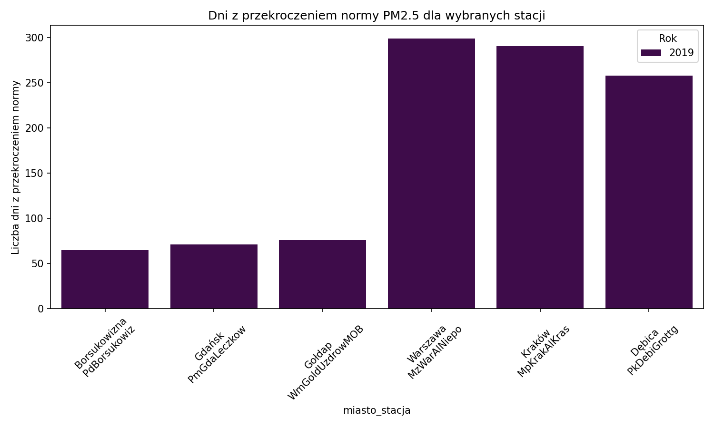
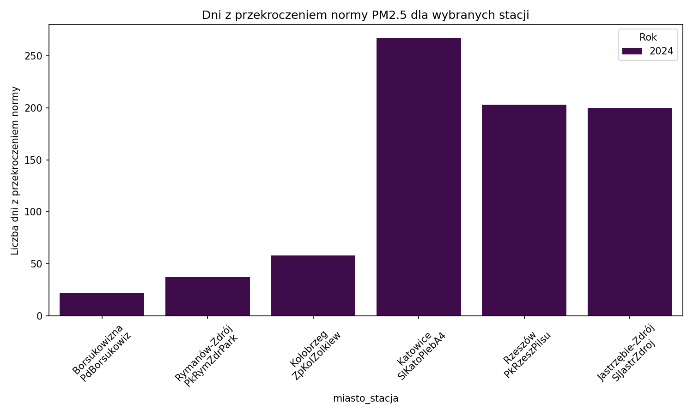
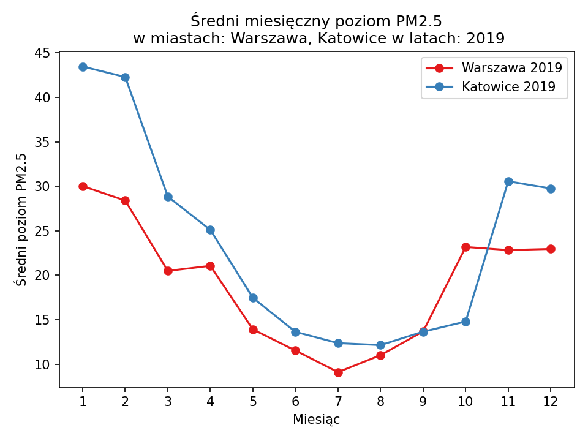
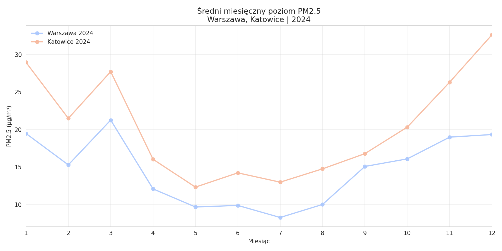
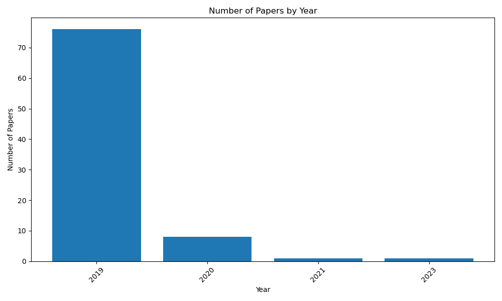
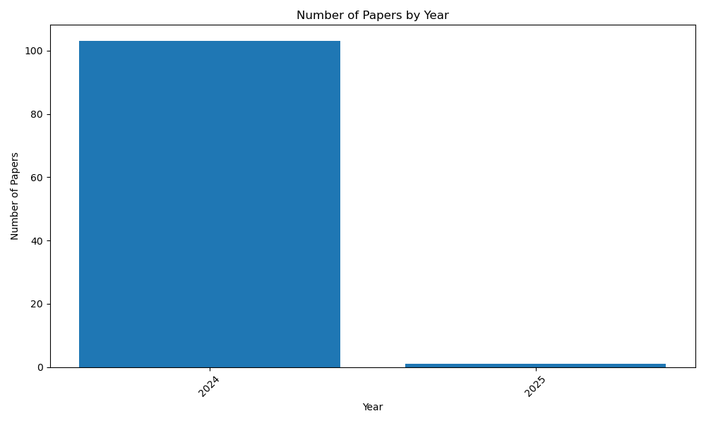
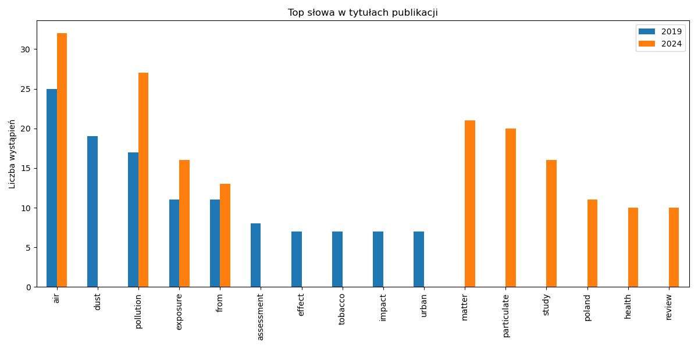

# Task 4 - Raport końcowy

Analiza jakości powietrza (PM2.5) oraz literatury naukowej (PubMed).

**Lata:** 2019, 2024

**Miasta:** Warszawa, Katowice

## PM2.5 - podsumowanie

Tabela przedstawia liczbę dni z przekroczeniem normy PM2.5.

Liczba dni w roku, w których średnie dobowe stężenie PM2.5 przekroczyło obowiązującą normę.

| Miejscowość         |   2019 |   2024 |
|:--------------------|-------:|-------:|
| Białystok           |    111 |    328 |
| Bielsko-Biała       |    258 |    171 |
| Borsukowizna        |     65 |     22 |
| Bydgoszcz           |    218 |    231 |
| Duszniki-Zdrój      |    176 |    nan |
| Dębica              |    258 |    185 |
| Elbląg              |    107 |    100 |
| Gdańsk              |     71 |    247 |
| Gołdap              |     76 |    nan |
| Horyniec-Zdrój      |    150 |    nan |
| Jarosław            |    225 |    128 |
| Jawor               |    155 |    nan |
| Jelenia Góra        |    169 |    109 |
| Kalisz              |    200 |    163 |
| Katowice            |    213 |    432 |
| Kielce              |    171 |    nan |
| Konstancin-Jeziorna |    170 |    102 |
| Kraków              |    712 |    330 |
| Kędzierzyn-Koźle    |    174 |    111 |
| Legionowo           |    207 |    121 |
| Lublin              |    201 |    170 |
| Mielec              |    200 |    144 |
| Mińsk Mazowiecki    |    209 |    nan |
| Mogilno             |    196 |    nan |
| Nałęczów            |    126 |    nan |
| Nowa Sól            |    152 |    nan |
| Olsztyn             |    136 |    139 |
| Otwock              |    226 |    135 |
| Piastów             |    194 |    124 |
| Prudnik             |    143 |    nan |
| Przemyśl            |    182 |    146 |
| Płock               |    188 |    131 |
| Radom               |    211 |    161 |
| Rymanów-Zdrój       |    139 |     37 |
| Rzeszów             |    190 |    396 |
| Siedlce             |    190 |     79 |
| Skarżysko-Kamienna  |    162 |    185 |
| Starachowice        |    175 |    145 |
| Suwałki             |     89 |     69 |
| Szczecin            |    364 |    202 |
| Tarnów              |    238 |     97 |
| Toruń               |    149 |    140 |
| Warszawa            |   1206 |    807 |
| Wrocław             |    335 |    264 |
| Wschowa             |    205 |     98 |
| Włocławek           |    221 |    182 |
| Zgierz              |    244 |    189 |
| Zielona Góra        |    108 |    145 |
| Złoty Potok         |    143 |    117 |
| Łódź                |    402 |    128 |
| Żary                |    109 |     83 |
| Żyrardów            |    170 |    142 |
| Augustów            |    nan |    156 |
| Biała               |    nan |    127 |
| Boguchwała          |    nan |    104 |
| Bytów               |    nan |     80 |
| Chojnów             |    nan |    170 |
| Działdowo           |    nan |    160 |
| Dąbki               |    nan |     73 |
| Ełk                 |    nan |    100 |
| Gdynia              |    nan |    143 |
| Goczałkowice-Zdrój  |    nan |    139 |
| Gorzów Wielkopolski |    nan |    115 |
| Grajewo             |    nan |     83 |
| Jastrzębie-Zdrój    |    nan |    200 |
| Jasło               |    nan |     89 |
| Kołobrzeg           |    nan |     58 |
| Kościan             |    nan |    143 |
| Kościerzyna         |    nan |    102 |
| Krosno              |    nan |     65 |
| Kudowa-Zdrój        |    nan |     98 |
| Kutno               |    nan |    181 |
| Kłodzko             |    nan |    129 |
| Lubsko              |    nan |     81 |
| Nakło nad Notecią   |    nan |    136 |
| Nisko               |    nan |    149 |
| Opole               |    nan |    120 |
| Poznań              |    nan |    270 |
| Połaniec            |    nan |    150 |
| Pułtusk             |    nan |    130 |
| Racibórz            |    nan |    186 |
| Radomsko            |    nan |    156 |
| Sopot               |    nan |    123 |
| Strzelce Opolskie   |    nan |     92 |
| Zamość              |    nan |    152 |
| Łagów               |    nan |    131 |
| Łask                |    nan |    157 |
| Łuków               |    nan |    137 |
| Świecie             |    nan |     92 |
| Żywiec              |    nan |    147 |

**Liczba dni z przekroczeniem normy PM2.5 dla roku 2019 (najwyższe i najniższe wartości):**

**Liczba dni z przekroczeniem normy PM2.5 dla roku 2024 (najwyższe i najniższe wartości):**

## Średnie miesięczne:

### Rok 2019

| ('Miejscowość', 'Kod stacji')   | ('', '')   |   ('Duszniki-Zdrój', 'DsDusznikMOB') |   ('Jawor', 'DsJaworMOB') |   ('Jelenia Góra', 'DsJelGorOgin') |   ('Wrocław', 'DsWrocAlWisn') |   ('Wrocław', 'DsWrocWybCon') |   ('Bydgoszcz', 'KpBydPlPozna') |   ('Mogilno', 'KpMogiNowMOB') |   ('Toruń', 'KpToruDziewu') |   ('Włocławek', 'KpWloclOkrze') |   ('Lublin', 'LbLubObywate') |   ('Nałęczów', 'LbNaleczAlMa') |   ('Łódź', 'LdLodzCzerni') |   ('Łódź', 'LdLodzGdansk') |   ('Zgierz', 'LdZgieMielcz') |   ('Nowa Sól', 'LuNowaSolMOB') |   ('Wschowa', 'LuWsKaziWiel') |   ('Żary', 'LuZarySzyman') |   ('Zielona Góra', 'LuZielKrotka') |   ('Kraków', 'MpKrakAlKras') |   ('Kraków', 'MpKrakBujaka') |   ('Kraków', 'MpKrakBulwar') |   ('Tarnów', 'MpTarRoSitko') |   ('Konstancin-Jeziorna', 'MzKonJezWieMOB') |   ('Legionowo', 'MzLegZegrzyn') |   ('Mińsk Mazowiecki', 'MzMinMazKaziMOB') |   ('Otwock', 'MzOtwoBrzozo') |   ('Piastów', 'MzPiasPulask') |   ('Płock', 'MzPlocMiReja') |   ('Radom', 'MzRadTochter') |   ('Siedlce', 'MzSiedKonars') |   ('Warszawa', 'MzWarAlNiepo') |   ('Warszawa', 'MzWarBajkowa') |   ('Warszawa', 'MzWarChrosci') |   ('Warszawa', 'MzWarKondrat') |   ('Warszawa', 'MzWarTolstoj') |   ('Warszawa', 'MzWarWokalna') |   ('Żyrardów', 'MzZyraRoosev') |   ('Kędzierzyn-Koźle', 'OpKKozBSmial') |   ('Prudnik', 'OpPrudPodgor') |   ('Białystok', 'PdBialUpalna') |   ('Borsukowizna', 'PdBorsukowiz') |   ('Suwałki', 'PdSuwPulask2') |   ('Dębica', 'PkDebiGrottg') |   ('Horyniec-Zdrój', 'PkHorZdrParkMOB') |   ('Jarosław', 'PkJarosPruch') |   ('Mielec', 'PkMielBierna') |   ('Przemyśl', 'PkPrzemGrunw') |   ('Rymanów-Zdrój', 'PkRymZdrPark') |   ('Rzeszów', 'PkRzeszPilsu') |   ('Gdańsk', 'PmGdaLeczkow') |   ('Kielce', 'SkKielTargow') |   ('Skarżysko-Kamienna', 'SkSkarZielnaMOB') |   ('Starachowice', 'SkStaraZlota') |   ('Bielsko-Biała', 'SlBielPartyz') |   ('Katowice', 'SlKatoKossut') |   ('Złoty Potok', 'SlZlotPotLes') |   ('Elbląg', 'WmElbBazynsk') |   ('Gołdap', 'WmGoldUzdrowMOB') |   ('Olsztyn', 'WmOlsPuszkin') |   ('Kalisz', 'WpKaliSawick') |   ('Szczecin', 'ZpSzczAndrze') |   ('Szczecin', 'ZpSzczBudzWosMOB') |   ('Szczecin', 'ZpSzczPilsud') |
|:--------------------------------|:-----------|-------------------------------------:|--------------------------:|-----------------------------------:|------------------------------:|------------------------------:|--------------------------------:|------------------------------:|----------------------------:|--------------------------------:|-----------------------------:|-------------------------------:|---------------------------:|---------------------------:|-----------------------------:|-------------------------------:|------------------------------:|---------------------------:|-----------------------------------:|-----------------------------:|-----------------------------:|-----------------------------:|-----------------------------:|--------------------------------------------:|--------------------------------:|------------------------------------------:|-----------------------------:|------------------------------:|----------------------------:|----------------------------:|------------------------------:|-------------------------------:|-------------------------------:|-------------------------------:|-------------------------------:|-------------------------------:|-------------------------------:|-------------------------------:|---------------------------------------:|------------------------------:|--------------------------------:|-----------------------------------:|------------------------------:|-----------------------------:|----------------------------------------:|-------------------------------:|-----------------------------:|-------------------------------:|------------------------------------:|------------------------------:|-----------------------------:|-----------------------------:|--------------------------------------------:|-----------------------------------:|------------------------------------:|-------------------------------:|----------------------------------:|-----------------------------:|--------------------------------:|------------------------------:|-----------------------------:|-------------------------------:|-----------------------------------:|-------------------------------:|
| rok                             | miesiąc    |                             nan      |                 nan       |                           nan      |                      nan      |                      nan      |                        nan      |                     nan       |                   nan       |                       nan       |                     nan      |                      nan       |                  nan       |                   nan      |                     nan      |                      nan       |                      nan      |                  nan       |                          nan       |                     nan      |                     nan      |                     nan      |                     nan      |                                   nan       |                       nan       |                                 nan       |                    nan       |                     nan       |                   nan       |                   nan       |                     nan       |                       nan      |                      nan       |                      nan       |                      nan       |                      nan       |                      nan       |                      nan       |                              nan       |                     nan       |                       nan       |                          nan       |                     nan       |                     nan      |                               nan       |                       nan      |                     nan      |                      nan       |                           nan       |                     nan       |                    nan       |                    nan       |                                   nan       |                          nan       |                            nan      |                       nan      |                         nan       |                    nan       |                       nan       |                     nan       |                     nan      |                      nan       |                          nan       |                      nan       |
| 2019                            | 1          |                              37.0351 |                  32.5736  |                            28.6596 |                       30.0988 |                       29.3082 |                         30.5366 |                      40.727   |                    28.3202  |                        37.2694  |                      34.0329 |                       37.1399  |                   29.8021  |                    38.7093 |                      47.6973 |                       31.1951  |                       32.9165 |                   19.5414  |                           20.2678  |                      44.4378 |                      39.7879 |                      30.0645 |                      41.5162 |                                    28.3661  |                        35.8332  |                                  36.5158  |                     36.5909  |                      35.5884  |                    28.5137  |                    38.9594  |                      34.291   |                        36.0162 |                       31.1496  |                       32.096   |                       22.3976  |                       32.2062  |                       26.2427  |                       34.2011  |                               39.2636  |                      31.5953  |                        23.594   |                           15.3311  |                      17.0968  |                      57.9452 |                                29.7633  |                        41.1481 |                      41.7406 |                       39.6247  |                            31.8179  |                      45.1669  |                    nan       |                     31.433   |                                    31.4492  |                           34.1709  |                             55.187  |                        43.4714 |                          29.2052  |                     23.4775  |                        20.3452  |                      25.1352  |                      30.5516 |                       18.107   |                          nan       |                       21.5894  |
| 2019                            | 2          |                              36.2443 |                  29.1872  |                            38.0647 |                       31.1049 |                       30.4466 |                         30.9707 |                      34.6938  |                    26.5009  |                        34.8278  |                      29.3694 |                       26.5218  |                   28.8953  |                    35.4683 |                      44.0703 |                       39.7414  |                       39.6771 |                   23.295   |                           20.5447  |                      51.6287 |                      40.9797 |                      32.4794 |                      32.6476 |                                    26.5803  |                        30.7293  |                                  33.2928  |                     33.5317  |                      31.5292  |                    27.1953  |                    34.4693  |                      31.8092  |                        35.6129 |                       30.0638  |                       28.7855  |                       22.2594  |                       29.4641  |                       24.1776  |                       27.6969  |                               36.6353  |                      32.9425  |                        19.456   |                           12.9164  |                      15.4492  |                      41.6316 |                                25.828   |                        37.6024 |                      31.1841 |                       30.6206  |                            20.6226  |                      28.6393  |                    nan       |                     42.0324  |                                    29.6156  |                           32.676   |                             42.0312 |                        42.2896 |                          23.2729  |                     23.273   |                        15.9675  |                      21.4827  |                      31.9625 |                       25.3321  |                          nan       |                       29.7097  |
| 2019                            | 3          |                              20.1641 |                  19.2463  |                            19.4798 |                       19.1796 |                       18.919  |                         16.3771 |                      20.6557  |                    15.169   |                        22.3428  |                      20.4644 |                       20.0557  |                   18.9581  |                    24.2865 |                      31.6988 |                       18.9763  |                       20.4309 |                   13.2409  |                           11.8387  |                      34.2411 |                      24.0501 |                      20.6797 |                      27.9373 |                                    18.0843  |                        21.5445  |                                  23.4883  |                     27.7217  |                      21.5375  |                    17.1446  |                    23.0619  |                      23.0676  |                        26.4904 |                       23.061   |                       20.5105  |                       16.8465  |                       18.6794  |                       17.3133  |                       19.1567  |                               21.5422  |                      17.867   |                        12.9546  |                            7.3909  |                      11.1709  |                      32.6355 |                                20.9497  |                        31.6507 |                      25.4966 |                       24.5176  |                            16.0852  |                      21.4199  |                    nan       |                     27.3162  |                                    18.9906  |                           22.4045  |                             31.2652 |                        28.8476 |                          16.996   |                     14.2115  |                        10.1524  |                      13.3741  |                      18.9473 |                       13.4119  |                           12.8059  |                       15.6422  |
| 2019                            | 4          |                              27.404  |                  22.295   |                            23.7632 |                       21.7186 |                       20.7074 |                         20.6799 |                      17.6946  |                    17.8334  |                        22.2295  |                      21.0015 |                       17.9951  |                   19.2236  |                    19.917  |                      22.9463 |                       21.2103  |                       25.6814 |                   15.1804  |                           14.0537  |                      27.3516 |                      26.5209 |                      20.556  |                      26.684  |                                    19.0104  |                        23.4666  |                                  21.4161  |                     27.0125  |                      21.0112  |                    19.9629  |                    24.9026  |                      23.698   |                        25.9284 |                       20.0134  |                       20.5164  |                       20.1561  |                       21.971   |                       17.7515  |                       19.8539  |                               23.4924  |                      19.8916  |                        16.3667  |                           12.8951  |                      13.6824  |                      29.2017 |                                15.9971  |                        23.2263 |                      22.4127 |                       22.0569  |                            16.2103  |                      19.2216  |                    nan       |                     18.7042  |                                    19.1207  |                           18.6245  |                             28.2595 |                        25.0939 |                          17.4131  |                     16.08    |                        13.6639  |                      17.8819  |                      22.9582 |                       17.5619  |                           15.7976  |                       20.9992  |
| 2019                            | 5          |                              13.5691 |                  10.6888  |                            13.2443 |                       13.7767 |                       12.7852 |                         15.5809 |                      13.3735  |                    11.7327  |                        15.9343  |                      12.4178 |                       10.0258  |                   12.7803  |                    13.5143 |                      14.8155 |                       11.5382  |                       14.3105 |                    7.17611 |                            8.34235 |                      19.2457 |                      15.16   |                      12.0084 |                      14.6738 |                                    11.9007  |                        14.3341  |                                  13.5471  |                     16.1776  |                      14.0064  |                    13.4263  |                    13.812   |                      14.7219  |                        19.5928 |                       12.7204  |                       13.7472  |                       11.5977  |                       14.18    |                       11.5714  |                       12.1762  |                               13.3941  |                       8.9002  |                         9.3986  |                            6.96432 |                       8.95432 |                      16.5865 |                                 9.06415 |                        13.543  |                      14.1358 |                       12.0218  |                             8.94118 |                      11.3303  |                    nan       |                     10.9262  |                                    11.612   |                           10.5039  |                             19.2978 |                        17.4553 |                          12.0511  |                     10.4486  |                         6.90856 |                      10.693   |                      15.1231 |                       10.7358  |                            9.43307 |                       12.5711  |
| 2019                            | 6          |                              13.1109 |                  10.7955  |                            11.8886 |                       12.8256 |                       11.8861 |                         20.1936 |                      12.0015  |                    10.8745  |                        13.1634  |                      10.7732 |                       10.0661  |                   11.1194  |                    14.3648 |                      14.7991 |                       10.9093  |                       14.9542 |                    9.50618 |                           10.3509  |                      16.7365 |                      15.5431 |                      13.4271 |                      15.0771 |                                     9.51199 |                        10.6969  |                                  12.1363  |                     12.4093  |                      10.7806  |                    11.7742  |                    11.6003  |                      11.3211  |                        17.2075 |                       10.1588  |                       10.7344  |                        9.73463 |                       11.8388  |                        9.49563 |                        9.79248 |                               11.8955  |                      10.0711  |                         8.46639 |                            6.56231 |                      10.1321  |                      15.5601 |                                10.2071  |                        13.0868 |                      12.9906 |                       12.5854  |                            13.4623  |                      11.9633  |                    nan       |                     11.2496  |                                    10.5467  |                           10.2778  |                             16.5598 |                        13.6262 |                          11.1604  |                      9.62204 |                         6.80189 |                      10.1749  |                      13.7541 |                       10.8483  |                            9.47323 |                       11.819   |
| 2019                            | 7          |                              10.3327 |                   8.58789 |                            10.4543 |                       11.026  |                       10.2028 |                         12.5228 |                       8.67813 |                     7.68346 |                         9.72597 |                      13.203  |                        7.52838 |                    7.96909 |                    11.3577 |                      10.0144 |                        8.34108 |                       10.5977 |                    7.55131 |                            8.84247 |                      16.0682 |                      14.3491 |                      11.8352 |                      12.7759 |                                     6.92243 |                         8.01808 |                                   9.29511 |                      9.47303 |                       8.51257 |                     8.87503 |                     9.88706 |                       8.42887 |                        15.1703 |                        7.33082 |                        8.38424 |                        7.56133 |                        9.12656 |                        7.00122 |                        7.5588  |                                9.53961 |                       7.5491  |                         6.12806 |                            4.23938 |                       7.31394 |                      11.795  |                                 8.57381 |                        11.6065 |                      11.1829 |                        9.42903 |                             9.10835 |                       8.83518 |                      9.42853 |                      9.54474 |                                     8.44328 |                            8.55057 |                             14.5511 |                        12.3611 |                           9.70994 |                      7.59967 |                         4.98908 |                       7.56947 |                      10.3695 |                        7.82078 |                            6.46832 |                        8.92361 |
| 2019                            | 8          |                              11.7557 |                   8.91729 |                            11.0996 |                       11.1486 |                       10.1696 |                         19.3186 |                      10.6451  |                    10.084   |                        12.1731  |                      12.2063 |                        9.39507 |                    9.34543 |                    14.7161 |                      14.8775 |                       10.0958  |                       11.8116 |                    9.02212 |                           10.036   |                      18.5051 |                      13.3159 |                      15.4855 |                      14.6711 |                                     9.18448 |                        10.0422  |                                  12.082   |                     11.8238  |                      10.3237  |                    11.0466  |                    11.9001  |                      11.5463  |                        16.6766 |                        9.6453  |                       10.4437  |                        9.04641 |                       11.47    |                        8.7738  |                        9.52453 |                               10.151   |                       8.15868 |                         8.35193 |                            5.45578 |                       9.14688 |                      15.0355 |                                10.2913  |                        12.5322 |                      12.4135 |                       11.9117  |                            10.8893  |                      11.3933  |                     11.4696  |                     11.9622  |                                    10.1078  |                           10.0054  |                             14.5503 |                        12.1393 |                          10.2249  |                      8.2061  |                         6.99111 |                      10.0622  |                      11.6339 |                        8.88901 |                            9.12853 |                       11.1353  |
| 2019                            | 9          |                              11.0304 |                   8.16593 |                            13.1074 |                       12.5208 |                       11.6849 |                         15.5933 |                      14.2013  |                    12.4386  |                        15.8556  |                      14.0008 |                       11.0755  |                   12.3586  |                    14.6382 |                      19.2336 |                        9.71949 |                       13.1415 |                    8.34007 |                            8.8995  |                      18.4784 |                      14.1534 |                      15.5016 |                      15.3638 |                                    11.3571  |                        14.1107  |                                  14.1119  |                     15.4765  |                      14.1633  |                    13.656   |                    14.317   |                      11.3103  |                        20.1005 |                       14.9683  |                       13.4229  |                       11.3603  |                       13.4951  |                        8.68759 |                       11.9809  |                                9.98757 |                       8.3308  |                         8.52496 |                            4.86695 |                       9.96894 |                      15.5994 |                                11.6718  |                        14.2627 |                      13.5348 |                       12.2279  |                             9.86129 |                      14.681   |                     11.3257  |                     13.4578  |                                    12.7182  |                           12.2195  |                             16.0909 |                        13.6491 |                          10.713   |                      7.46614 |                         6.52622 |                       9.63897 |                      14.2502 |                       10.1172  |                            9.97314 |                       11.9155  |
| 2019                            | 10         |                              19.899  |                  17.0023  |                            21.4689 |                       20.0905 |                       18.0065 |                         24.5749 |                      24.6964  |                    18.1035  |                        29.6012  |                      26.2333 |                       25.4454  |                   20.3962  |                    25.2304 |                      33.5139 |                       19.4521  |                       24.5036 |                   16.4633  |                           14.2565  |                      30.886  |                      23.0584 |                      26.6905 |                      25.3023 |                                    19.2011  |                        27.1631  |                                  24.5791  |                     28.3223  |                      22.6967  |                    21.3405  |                    24.6483  |                      23.623   |                        28.4717 |                       26.1003  |                       22.6283  |                       19.2405  |                       23.3528  |                       19.25    |                       19.7067  |                               17.3836  |                      17.2466  |                        16.1781  |                           10.8803  |                      14.2148  |                      27.471  |                                23.2164  |                        30.1633 |                      24.2018 |                       16.6015  |                            18.9464  |                      24.707   |                     17.6769  |                     26.1489  |                                    19.9115  |                           24.0638  |                             26.3627 |                        14.7898 |                          15.3825  |                     12.945   |                         9.40244 |                      16.7657  |                      22.1903 |                       13.517   |                           15.6336  |                       16.2495  |
| 2019                            | 11         |                              17.515  |                  24.4878  |                            24.3319 |                       23.6089 |                       23.1817 |                         27.4403 |                      28.2303  |                    21.9529  |                        31.6132  |                      23.1321 |                       17.161   |                   21.3627  |                    28.1871 |                      29.1781 |                       29.9155  |                       27.2851 |                   22.2708  |                           19.0046  |                      35.604  |                      26.0665 |                      29.5696 |                      22.5676 |                                    19.2663  |                        27.931   |                                  24.9151  |                     26.893   |                      23.7482  |                    24.1464  |                    23.7855  |                      18.7582  |                        26.893  |                       22.446   |                       23.4767  |                       20.2003  |                       24.4584  |                       19.4912  |                       22.0607  |                               20.2866  |                      21.2633  |                        15.614   |                           11.6558  |                      14.1339  |                      25.0655 |                                17.4862  |                        22.3235 |                      19.0879 |                       20.6329  |                            13.3015  |                      20.6466  |                     27.211   |                     19.7021  |                                    21.9096  |                           21.0768  |                             33.9315 |                        30.5635 |                          18.5044  |                     17.7994  |                        14.3992  |                      20.4266  |                      22.7047 |                       21.1612  |                           24.1424  |                       25.3767  |
| 2019                            | 12         |                              26.5025 |                  19.9837  |                            25.9555 |                       23.4325 |                       21.7603 |                         24.8573 |                      28.066   |                    21.4583  |                        31.7218  |                      24.2081 |                       13.326   |                   21.5659  |                    32.6978 |                      35.5217 |                       33.0371  |                       27.3973 |                   15.5689  |                           17.1886  |                      38.0904 |                      32.2302 |                      31.7979 |                      22.6912 |                                    20.8503  |                        27.9593  |                                  26.6435  |                     31.4158  |                      25.6438  |                    23.5013  |                    27.819   |                      24.3752  |                        26.7951 |                       23.7699  |                       24.3536  |                       20.2683  |                       23.1152  |                       19.4173  |                       20.7293  |                               21.4081  |                      26.3466  |                        16.359   |                           11.4136  |                      12.4004  |                      25.3523 |                                22.9944  |                        22.742  |                      22.1256 |                       22.741   |                            16.0628  |                      20.8126  |                     21.4605  |                     23.3393  |                                    23.6829  |                           25.075   |                             33.8598 |                        29.7537 |                          20.3516  |                     17.2144  |                        15.2454  |                      17.3555  |                      24.561  |                       13.7619  |                           17.9243  |                       18.7262  |

### Rok 2024

| ('Miejscowość', 'Kod stacji')   | ('', '')   |   ('Chojnów', 'DsChojnowMalMOB') |   ('Jelenia Góra', 'DsJelGorOgin') |   ('Kłodzko', 'DsKlodzSzkol') |   ('Kudowa-Zdrój', 'DsKudowaSzkoMOB') |   ('Wrocław', 'DsWrocAlWisn') |   ('Wrocław', 'DsWrocWybCon') |   ('Bydgoszcz', 'KpBydPlPozna') |   ('Bydgoszcz', 'KpBydWarszaw') |   ('Nakło nad Notecią', 'KpNaklWawrzy') |   ('Świecie', 'KpSwiecJPawlMOB') |   ('Toruń', 'KpToruKaszow') |   ('Włocławek', 'KpWloclOkrze') |   ('Lublin', 'LbLubObywate') |   ('Łuków', 'LbLukBulNiepMOB') |   ('Zamość', 'LbZamoHrubie') |   ('Kutno', 'LdKutn1Maja7MOB') |   ('Łask', 'LdLaskNarutoMOB') |   ('Łódź', 'LdLodzCzerni') |   ('Radomsko', 'LdRadomsRoln') |   ('Zgierz', 'LdZgieMielcz') |   ('Gorzów Wielkopolski', 'LuGorzKosGdy') |   ('Lubsko', 'LuLubsStrzelMOB ') |   ('Wschowa', 'LuWsKaziWiel') |   ('Żary', 'LuZarySzyman') |   ('Zielona Góra', 'LuZielKrotka') |   ('Kraków', 'MpKrakAlKras') |   ('Kraków', 'MpKrakBulwar') |   ('Tarnów', 'MpTarRoSitko') |   ('Biała', 'MzBialaKmiciMOB') |   ('Konstancin-Jeziorna', 'MzKonJezZero') |   ('Legionowo', 'MzLegZegrzyn') |   ('Otwock', 'MzOtwoBrzozo') |   ('Piastów', 'MzPiasPulask') |   ('Płock', 'MzPlocMiReja') |   ('Pułtusk', 'MzPultuskMicMOB') |   ('Radom', 'MzRadTochter') |   ('Siedlce', 'MzSiedKonars') |   ('Warszawa', 'MzWarAlNiepo') |   ('Warszawa', 'MzWarBajkowa') |   ('Warszawa', 'MzWarChrosci') |   ('Warszawa', 'MzWarKondrat') |   ('Warszawa', 'MzWarTolstoj') |   ('Warszawa', 'MzWarWokalna') |   ('Żyrardów', 'MzZyraRoosev') |   ('Kędzierzyn-Koźle', 'OpKKozBSmial') |   ('Opole', 'OpOpoleKoszy') |   ('Strzelce Opolskie', 'OpStrzOpWyszMOB') |   ('Augustów', 'PdAugustowUz') |   ('Białystok', 'PdBialAlPils') |   ('Białystok', 'PdBialPPiech') |   ('Białystok', 'PdBialUpalna') |   ('Borsukowizna', 'PdBorsukowiz') |   ('Grajewo', 'PdGrajewoWPoMOB') |   ('Suwałki', 'PdSuwPulask2') |   ('Boguchwała', 'PkBoguchAngeMOB') |   ('Dębica', 'PkDebiGrottg') |   ('Jarosław', 'PkJarosPruch') |   ('Jasło', 'PkJasloSikor') |   ('Krosno', 'PkKrosKletow') |   ('Mielec', 'PkMielBierna') |   ('Nisko', 'PkNiskoSzkla') |   ('Przemyśl', 'PkPrzemGrunw') |   ('Rymanów-Zdrój', 'PkRymZdrPark') |   ('Rzeszów', 'PkRzeszPilsu') |   ('Rzeszów', 'PkRzeszSloci') |   ('Rzeszów', 'PkRzeszStarz') |   ('Bytów', 'PmBytowMila1MOB') |   ('Gdańsk', 'PmGdaLeczkow') |   ('Gdańsk', 'PmGdaWyzwole') |   ('Gdynia', 'PmGdyPorebsk') |   ('Kościerzyna', 'PmKosTargowa') |   ('Sopot', 'PmSopBiPlowc') |   ('Łagów', 'SkLagowZaploMOB') |   ('Połaniec', 'SkPolaRuszcz') |   ('Skarżysko-Kamienna', 'SkSkarz1MajaMOB') |   ('Starachowice', 'SkStaraZlota') |   ('Bielsko-Biała', 'SlBielPartyz') |   ('Goczałkowice-Zdrój', 'SlGoczaUzdroMOB') |   ('Jastrzębie-Zdrój', 'SlJastrZdroj') |   ('Katowice', 'SlKatoKossut') |   ('Katowice', 'SlKatoPlebA4') |   ('Racibórz', 'SlRaciborzWPMOB') |   ('Złoty Potok', 'SlZlotPotLes') |   ('Żywiec', 'SlZywieKoper') |   ('Działdowo', 'WmDzialPolnaMOB') |   ('Elbląg', 'WmElbBazynsk') |   ('Ełk', 'WmElkStadion') |   ('Olsztyn', 'WmOlsPuszkin') |   ('Kalisz', 'WpKaliSawick') |   ('Kościan', 'WpKoscianMayMOB') |   ('Poznań', 'WpPoznDabrow') |   ('Poznań', 'WpPoznSzwajc') |   ('Dąbki', 'ZpDabkiSztorMOB') |   ('Kołobrzeg', 'ZpKolZolkiew') |   ('Szczecin', 'ZpSzczAndrze') |   ('Szczecin', 'ZpSzczPilsud') |
|:--------------------------------|:-----------|---------------------------------:|-----------------------------------:|------------------------------:|--------------------------------------:|------------------------------:|------------------------------:|--------------------------------:|--------------------------------:|----------------------------------------:|---------------------------------:|----------------------------:|--------------------------------:|-----------------------------:|-------------------------------:|-----------------------------:|-------------------------------:|------------------------------:|---------------------------:|-------------------------------:|-----------------------------:|------------------------------------------:|---------------------------------:|------------------------------:|---------------------------:|-----------------------------------:|-----------------------------:|-----------------------------:|-----------------------------:|-------------------------------:|------------------------------------------:|--------------------------------:|-----------------------------:|------------------------------:|----------------------------:|---------------------------------:|----------------------------:|------------------------------:|-------------------------------:|-------------------------------:|-------------------------------:|-------------------------------:|-------------------------------:|-------------------------------:|-------------------------------:|---------------------------------------:|----------------------------:|-------------------------------------------:|-------------------------------:|--------------------------------:|--------------------------------:|--------------------------------:|-----------------------------------:|---------------------------------:|------------------------------:|------------------------------------:|-----------------------------:|-------------------------------:|----------------------------:|-----------------------------:|-----------------------------:|----------------------------:|-------------------------------:|------------------------------------:|------------------------------:|------------------------------:|------------------------------:|-------------------------------:|-----------------------------:|-----------------------------:|-----------------------------:|----------------------------------:|----------------------------:|-------------------------------:|-------------------------------:|--------------------------------------------:|-----------------------------------:|------------------------------------:|--------------------------------------------:|---------------------------------------:|-------------------------------:|-------------------------------:|----------------------------------:|----------------------------------:|-----------------------------:|-----------------------------------:|-----------------------------:|--------------------------:|------------------------------:|-----------------------------:|---------------------------------:|-----------------------------:|-----------------------------:|-------------------------------:|--------------------------------:|-------------------------------:|-------------------------------:|
| rok                             | miesiąc    |                         nan      |                          nan       |                     nan       |                             nan       |                     nan       |                     nan       |                       nan       |                       nan       |                               nan       |                        nan       |                    nan      |                       nan       |                     nan      |                      nan       |                     nan      |                       nan      |                     nan       |                  nan       |                       nan      |                    nan       |                                 nan       |                        nan       |                     nan       |                  nan       |                           nan      |                     nan      |                     nan      |                    nan       |                      nan       |                                 nan       |                       nan       |                    nan       |                     nan       |                   nan       |                        nan       |                    nan      |                     nan       |                      nan       |                      nan       |                      nan       |                      nan       |                      nan       |                      nan       |                      nan       |                              nan       |                   nan       |                                  nan       |                      nan       |                       nan       |                       nan       |                       nan       |                          nan       |                        nan       |                     nan       |                            nan      |                    nan       |                      nan       |                   nan       |                    nan       |                    nan       |                   nan       |                       nan      |                           nan       |                      nan      |                     nan       |                     nan       |                      nan       |                     nan      |                    nan       |                    nan       |                         nan       |                   nan       |                      nan       |                      nan       |                                   nan       |                          nan       |                            nan      |                                   nan       |                               nan      |                      nan       |                       nan      |                          nan      |                         nan       |                    nan       |                          nan       |                    nan       |                 nan       |                     nan       |                     nan      |                        nan       |                    nan       |                    nan       |                      nan       |                       nan       |                      nan       |                       nan      |
| 2024                            | 1          |                          25.4516 |                           23.2749  |                      32.6199  |                              21.9487  |                      24.5965  |                      20.2469  |                        17.4656  |                        19.8929  |                                23.5781  |                         16.7723  |                     19.0935 |                        26.9563  |                      22.482  |                       22.5851  |                      22.2335 |                        25.4127 |                      27.5778  |                   19.6516  |                        27.9231 |                     34.6381  |                                  20.136   |                         26.6852  |                      16.9242  |                   14.3263  |                            13.487  |                      25.0583 |                      26.5282 |                     22.2764  |                       18.4539  |                                  16.8288  |                        20.1673  |                     21.7801  |                      20.5221  |                    18.1285  |                         19.2853  |                     21.6237 |                      22.7035  |                       20.9673  |                       20.0215  |                       16.8185  |                       17.7696  |                       23.9531  |                       17.3824  |                       20.3571  |                               26.153   |                    37.8392  |                                   23.3843  |                       28.3946  |                        20.2258  |                        18.0588  |                        15.414   |                            9.04315 |                         16.0583  |                      13.1716  |                             12.9112 |                     30.4014  |                       25.4531  |                    19.1536  |                     19.795   |                     33.0868  |                    23.1707  |                        22.5017 |                            12.6895  |                       27.5085 |                      22.9139  |                      24.9137  |                       11.003   |                      16.5505 |                     13.2247  |                     15.8063  |                          20.0513  |                    14.3207  |                       22.9707  |                       29.5531  |                                    35.5839  |                           27.5896  |                             27.3048 |                                    30.4719  |                                28.9098 |                       25.7196  |                        32.2109 |                           28.4601 |                          17.1175  |                     27.9785  |                           34.1356  |                     15.7914  |                  14.0454  |                      18.5094  |                      24.5074 |                         30.3873  |                     27.042   |                     17.9546  |                       10.816   |                        10.7608  |                       11.5047  |                        14.529  |
| 2024                            | 2          |                          23.7279 |                           13.5062  |                      18.7997  |                              15.554   |                      16.5534  |                      14.0305  |                        14.6891  |                        16.0904  |                                19.7295  |                         13.1013  |                     14.9408 |                        23.6046  |                      17.857  |                       17.3122  |                      18.4921 |                        20.6878 |                      18.6412  |                   15.9209  |                        17.0588 |                     23.8985  |                                  13.8403  |                         12.4401  |                      14.5322  |                    8.41962 |                            13.3684 |                      21.9588 |                      19.7957 |                     16.0911  |                       16.7835  |                                  13.6023  |                        16.9144  |                     15.6509  |                      15.9611  |                    15.8905  |                         16.2536  |                     18.3503 |                      17.7358  |                       16.0032  |                       15.1777  |                       13.0158  |                       14.8208  |                       19.118   |                       13.6647  |                       17.7533  |                               13.5362  |                    24.424   |                                   12.3158  |                       17.2376  |                        15.9925  |                        12.3441  |                        11.0073  |                            5.52478 |                         12.0522  |                      12.3931  |                             16.8909 |                     19.8556  |                       19.3161  |                    11.8281  |                      9.44075 |                     18.4154  |                    19.0414  |                        20.9503 |                             9.94158 |                       21.9628 |                      16.1931  |                      16.0368  |                       10.0601  |                      15.185  |                     12.193   |                     16.8651  |                          14.0322  |                    13.1809  |                       20.0147  |                       18.8254  |                                    24.8291  |                           18.071   |                             18.8996 |                                    18.8092  |                                20.3677 |                       18.9108  |                        24.0866 |                           19.5124 |                          13.3023  |                     24.0871  |                           25.005   |                     14.1957  |                  15.071   |                      16.1422  |                      18.6193 |                         20.7402  |                     25.0671  |                     13.2599  |                       10.3272  |                        10.5156  |                        9.03511 |                        13.5395 |
| 2024                            | 3          |                          29.2716 |                           19.9343  |                      24.0953  |                              17.7692  |                      24.2412  |                      21.0382  |                        23.0968  |                        23.3586  |                                26.6121  |                         18.5608  |                     22.3655 |                        32.8751  |                      25.7542 |                       24.0804  |                      24.451  |                        28.6757 |                      29.8039  |                   21.4355  |                        25.7298 |                     29.8923  |                                  28.5655  |                         20.1435  |                      23.1085  |                   25.1872  |                            27.6891 |                      27.7129 |                      25.8497 |                     18.4929  |                       23.1607  |                                  19.2682  |                        22.5763  |                     21.7605  |                      21.605   |                    22.5191  |                         22.2454  |                     23.9499 |                      26.5257  |                       22.2751  |                       21.3078  |                       17.9144  |                       20.9072  |                       26.5065  |                       18.6942  |                       25.4715  |                               20.0681  |                    22.6941  |                                   19.2798  |                       21.0237  |                        22.9456  |                        17.1942  |                        17.3069  |                           10.1135  |                         18.3041  |                      14.6264  |                             17.9737 |                     26.0964  |                       22.304   |                    13.8135  |                     11.9272  |                     23.9526  |                    21.7669  |                        23.7296 |                            11.8117  |                       27.5958 |                      20.1376  |                      21.1824  |                       18.2038  |                      22.5792 |                     17.9399  |                     23.0823  |                          21.4059  |                    20.2922  |                       22.6942  |                       24.1704  |                                    29.5942  |                           25.333   |                             27.1272 |                                    24.7492  |                                26.7746 |                       24.6512  |                        30.7968 |                           25.9141 |                          20.7783  |                     28.3537  |                           29.7397  |                     19.011   |                  18.6106  |                      21.3894  |                      28.0211 |                         29.462   |                     29.8078  |                     24.2113  |                       22.6563  |                        17.8636  |                       25.6095  |                        28.6413 |
| 2024                            | 4          |                          14.8887 |                            9.88653 |                      11.3263  |                               8.65174 |                      11.8944  |                       9.80362 |                        11.3108  |                        10.4337  |                                12.081   |                          9.22194 |                     13.8165 |                        15.9372  |                      14.3338 |                       14.8333  |                      13.8503 |                        15.2897 |                      14.1622  |                    9.44134 |                        13.5004 |                     14.0854  |                                   9.84833 |                          7.77264 |                       9.71306 |                   11.4126  |                            14.0256 |                      15.3679 |                      14.0074 |                     10.361   |                       11.7262  |                                  10.3185  |                        11.688   |                     11.9103  |                      11.8844  |                    11.1593  |                         11.6721  |                     14.0715 |                      13.6606  |                       13.7794  |                       12.2197  |                       10.2617  |                       11.4135  |                       14.5525  |                       10.3706  |                       11.6457  |                                9.39847 |                     8.44056 |                                    8.41769 |                       12.0061  |                        13.3363  |                        10.2671  |                        10.525   |                            4.99066 |                         11.4503  |                       9.11736 |                             13.7699 |                     12.5689  |                       12.4528  |                     7.97365 |                      7.49298 |                     13.2454  |                    11.5744  |                        13.0232 |                             7.70486 |                       16.6899 |                      11.9478  |                      11.2686  |                       12.759   |                      15.1312 |                     14.5127  |                     15.5108  |                          15.7124  |                    13.55    |                       11.9729  |                       13.7672  |                                    14.6221  |                           12.3181  |                             16.2617 |                                    12.3191  |                                15.6092 |                       13.3983  |                        18.6868 |                           14.5327 |                          11.42    |                     13.5699  |                           13.6549  |                      9.92667 |                  10.5508  |                      12.7896  |                      13.4712 |                         11.8031  |                     13.5127  |                     12.3719  |                       10.8456  |                         7.54042 |                        9.18092 |                        13.8844 |
| 2024                            | 5          |                          11.883  |                            8.23468 |                       7.95148 |                               7.2397  |                      11.0413  |                       9.18427 |                        10.8731  |                         9.57363 |                                 9.92016 |                          9.99637 |                     12.9225 |                        13.1158  |                      10.4833 |                       11.2368  |                      10.1535 |                        12.897  |                      11.2368  |                   10.5571  |                        11.0292 |                      8.74166 |                                  10.4109  |                          7.06788 |                       7.54637 |                   12.6676  |                            18.8923 |                      13.2499 |                      10.7712 |                      7.64987 |                       11.6471  |                                   8.28683 |                         9.50349 |                      9.96734 |                       9.08185 |                     9.85269 |                          9.77634 |                     11.1777 |                       9.88477 |                       11.3663  |                        9.85161 |                        7.82661 |                        9.49583 |                       11.6324  |                        7.9796  |                        9.66959 |                                8.02853 |                     7.34583 |                                    7.47881 |                       11.828   |                        11.6391  |                         9.68062 |                        10.6102  |                            5.28733 |                         10.1813  |                       8.96783 |                             10.8367 |                      8.29922 |                        8.46532 |                     5.31465 |                      5.00517 |                     10.2329  |                     9.26977 |                        10.6687 |                             5.61344 |                       13.2892 |                       8.78538 |                       8.55718 |                       11.9364  |                      14.4505 |                     13.3292  |                     13.6883  |                          11.3482  |                    13.1527  |                        9.69852 |                       10.1008  |                                     9.43965 |                           10.3221  |                             12.6009 |                                     9.26833 |                                12.8184 |                        9.58881 |                        15.0894 |                           12.1691 |                           8.57823 |                      9.23965 |                            8.88078 |                      7.50417 |                   9.21252 |                      12.6699  |                      12.6827 |                          9.27056 |                     11.5448  |                     11.5852  |                       12.2759  |                         9.6475  |                        9.60941 |                        14.0055 |
| 2024                            | 6          |                          12.5518 |                            9.51333 |                       8.05361 |                               9.96405 |                      10.5095  |                       9.42962 |                         8.96173 |                         9.07472 |                                 8.87028 |                          9.39917 |                     11.8771 |                        10.0503  |                      11.3768 |                       11.6169  |                      10.2263 |                        12.1154 |                      10.541   |                    9.70417 |                        11.7891 |                      9.0098  |                                   9.69025 |                          7.56542 |                      11.1445  |                    8.61558 |                            15.5206 |                      12.5538 |                      11.8001 |                      7.97389 |                       10.4275  |                                   8.6602  |                         9.11569 |                      9.75833 |                       9.37097 |                     9.62857 |                          8.98122 |                     11.4886 |                      13.7196  |                       11.5047  |                       10.0637  |                        7.73014 |                        9.53396 |                       12.1393  |                        8.42409 |                        9.1681  |                                8.28875 |                     4.95444 |                                    8.54826 |                       10.7706  |                        11.0078  |                         8.59278 |                        10.5075  |                            5.33592 |                          8.92024 |                       6.94069 |                             10.8625 |                     12.0025  |                        7.24729 |                     7.76196 |                      5.50029 |                      9.98775 |                    11.1215  |                        10.9249 |                             6.93853 |                       11.8548 |                       8.17159 |                       7.43226 |                       10.3309  |                      12.3352 |                     10.8472  |                     12.3887  |                           9.83519 |                    11.5657  |                        9.55258 |                        9.14268 |                                     9.0025  |                            9.56252 |                             11.5181 |                                     9.10813 |                                12.9759 |                       11.9018  |                        16.5735 |                           12.2489 |                           9.74    |                      8.46    |                            7.67861 |                      9.34    |                   8.13681 |                      11.3559  |                      12.2783 |                          9.26299 |                     10.2482  |                     11.0667  |                       10.7165  |                         8.20986 |                        9.19108 |                        12.5201 |
| 2024                            | 7          |                          11.0288 |                            7.45376 |                       6.47809 |                               8.74058 |                       9.09769 |                       8.48293 |                         7.75873 |                         7.72291 |                                 7.83171 |                          7.42164 |                     10.1326 |                         7.90739 |                      10.4484 |                        9.10769 |                      10.1343 |                        10.565  |                       9.06051 |                    7.75868 |                        12.5681 |                      8.68374 |                                   7.99282 |                          5.58037 |                       6.29048 |                    7.8121  |                            10.8836 |                      12.3677 |                      11.4976 |                      9.95118 |                        8.37372 |                                   6.79179 |                         8.07712 |                      8.61391 |                       8.03883 |                     7.9004  |                          8.2078  |                     10.1758 |                     nan       |                        9.94468 |                        8.31371 |                        6.99295 |                        7.96482 |                        9.47994 |                        7.0628  |                        7.4289  |                                7.62361 |                     2.84207 |                                    7.27339 |                        8.17137 |                         8.41089 |                         7.62943 |                         8.05241 |                            4.16713 |                          6.75775 |                       7.80162 |                             11.4092 |                     12.1044  |                        8.18481 |                     8.73507 |                      6.98694 |                     10.1086  |                    11.2035  |                        11.5467 |                             7.93607 |                       12.0659 |                       8.54422 |                       7.91089 |                        8.30968 |                       9.7638 |                      7.51023 |                      9.75156 |                           7.43562 |                     9.02853 |                        8.53486 |                        9.75849 |                                     8.17984 |                            6.97156 |                             11.3007 |                                     9.03049 |                                12.3597 |                       10.4968  |                        15.4997 |                           11.1264 |                           8.80499 |                      8.37228 |                            6.24073 |                      8.28401 |                   6.36989 |                       9.50625 |                      10.2617 |                          7.2336  |                      8.11586 |                      9.35941 |                        8.77554 |                         6.2047  |                        6.9332  |                        10.7047 |
| 2024                            | 8          |                          13.2153 |                            9.37258 |                       7.82022 |                               9.9526  |                      11.5741  |                      13.2866  |                         9.20973 |                         9.17977 |                                 9.63257 |                          8.18387 |                     11.7952 |                         8.56986 |                      12.9167 |                       10.3567  |                      12.2433 |                        12.2407 |                      10.7172  |                    9.85148 |                        14.2524 |                     10.9326  |                                   9.44046 |                          7.33763 |                       7.2043  |                    9.84669 |                            13.2757 |                      12.7316 |                      12.9187 |                      7.89597 |                        9.65299 |                                   8.19315 |                         9.00538 |                      9.8     |                       9.39059 |                    10.7829  |                          9.41184 |                     11.9172 |                     nan       |                       11.6241  |                        9.59771 |                        9.00578 |                        9.51696 |                       11.8922  |                        8.5429  |                        9.49341 |                                9.26294 |                     6.91359 |                                    9.12867 |                       10.3367  |                        10.593   |                         9.42881 |                        10.8222  |                            5.55559 |                          8.77473 |                      10.1377  |                             12.686  |                     14.2651  |                        9.8581  |                     8.9984  |                      7.25302 |                     12.8191  |                    12.873   |                        12.9716 |                             8.35855 |                       13.2795 |                       9.39146 |                       9.31599 |                        9.90524 |                      11.6289 |                      9.13351 |                     11.4814  |                           8.20806 |                    10.9929  |                       10.2265  |                       12.1759  |                                    11.3054  |                            8.21655 |                             13.0733 |                                    10.4049  |                                14.0931 |                       11.9488  |                        17.597  |                           12.6337 |                          11.3386  |                     10.6489  |                            6.4039  |                      9.73414 |                   7.83215 |                      11.9468  |                      12.8734 |                          9.22204 |                     10.0364  |                     11.2039  |                       10.6836  |                         7.35766 |                        8.80336 |                        12.7719 |
| 2024                            | 9          |                          16.094  |                           11.4912  |                      11.0954  |                               8.09581 |                      13.1146  |                      15.8568  |                        12.9134  |                        13.9175  |                                14.4414  |                          9.15736 |                     16.9958 |                        16.52    |                      18.2249 |                       14.018   |                      16.9855 |                        16.6493 |                      15.6069  |                   13.9848  |                        15.2079 |                     14.9731  |                                  14.2176  |                         10.3607  |                      10.0399  |                   13.3545  |                            19.2498 |                      15.2784 |                      14.6658 |                     11.5925  |                       13.8722  |                                  12.7091  |                        13.6842  |                     13.4114  |                      13.6888  |                    14.3353  |                         15.0188  |                     15.6537 |                     nan       |                       16.26    |                       14.5182  |                       12.9922  |                       15.1552  |                       18.8215  |                       12.798   |                       14.3922  |                               12.1874  |                     9.14826 |                                   11.0207  |                       16.7154  |                        17.3519  |                        14.1797  |                        13.6412  |                           10.4681  |                         14.2948  |                      14.674   |                             14.5374 |                     16.5874  |                       13.8848  |                    11.8803  |                      8.33721 |                     16.4772  |                    13.9189  |                        15.6556 |                             9.9725  |                       17.2805 |                      12.4024  |                      12.2742  |                       13.4806  |                      16.0223 |                     12.4796  |                     15.3129  |                          11.4799  |                    14.8495  |                       14.4446  |                       17.7441  |                                    15.2612  |                           16.3108  |                             14.316  |                                    12.3619  |                                16.1936 |                       13.9561  |                        19.6356 |                           15.1724 |                          13.5463  |                     11.3447  |                           11.8303  |                     14.2008  |                  13.5014  |                      15.6394  |                      17.3578 |                         14.1676  |                     14.2434  |                     12.2179  |                       14.2223  |                        11.2759  |                       14.0486  |                        16.8761 |
| 2024                            | 10         |                          22.8555 |                           13.6779  |                      16.5508  |                              15.1152  |                      15.1256  |                      17.4688  |                        13.1042  |                        17.4666  |                                17.5513  |                         12.6244  |                     13.7329 |                        20.9359  |                      21.4822 |                       15.5001  |                      17.4435 |                        20.158  |                      17.8281  |                   16.0398  |                        17.3136 |                     22.5424  |                                  14.4727  |                         12.2647  |                      12.5331  |                   11.5933  |                            16.2647 |                      17.136  |                      16.7254 |                     11.1702  |                       14.8459  |                                  13.7573  |                        16.3393  |                     17.689   |                      15.1522  |                    14.9561  |                         16.4256  |                     17.6135 |                     nan       |                       16.5533  |                       16.8886  |                       14.5805  |                       14.5987  |                       19.5043  |                       14.4747  |                       16.4741  |                               12.9953  |                    12.9074  |                                   13.262   |                       16.9681  |                        16.102   |                        13.2973  |                        12.5821  |                            5.62476 |                         12.3692  |                      10.751   |                             16.4237 |                     20.8834  |                       15.5863  |                    14.1084  |                     10.3806  |                     19.1785  |                    18.6876  |                        17.3013 |                             8.68602 |                       18.2788 |                      14.1272  |                      10.2439  |                        9.82567 |                      14.0748 |                     11.7333  |                     13.9366  |                          13.4578  |                    12.366   |                       15.4271  |                       18.6303  |                                    23.1908  |                           17.397   |                             20.7559 |                                    21.4278  |                                22.6387 |                       16.7992  |                        23.8598 |                           20.7664 |                          13.9397  |                     20.9011  |                           20.525   |                     13.7173  |                  12.5165  |                      14.7912  |                      19.584  |                         19.2405  |                     15.756   |                     14.9989  |                       11.9069  |                        10.3029  |                        9.92221 |                        16.2226 |
| 2024                            | 11         |                          23.3171 |                           20.9625  |                      25.4609  |                              19.9783  |                      20.1026  |                      21.7343  |                        14.3324  |                        20.2146  |                                19.9624  |                         21.174   |                     16.4422 |                        23.2387  |                      24.9449 |                       19.1156  |                      21.8021 |                        23.8379 |                      24.4771  |                   20.0723  |                        21.9649 |                     33.8663  |                                  16.1936  |                         15.739   |                      16.6189  |                   13.4761  |                            15.2782 |                      22.1239 |                      20.8987 |                     14.9341  |                       16.7268  |                                  16.0472  |                        17.6353  |                     22.7177  |                      17.1265  |                    18.1263  |                         20.1971  |                     22.8475 |                     nan       |                       19.5025  |                       21.3381  |                       18.0509  |                       16.2936  |                       22.8711  |                       15.9205  |                       19.611   |                               19.2449  |                    20.0758  |                                   17.7499  |                       23.0089  |                        17.9031  |                        16.0792  |                        14.2399  |                            7.62583 |                         14.6234  |                      10.1028  |                             19.4253 |                     30.0471  |                       22.2858  |                    18.2997  |                     18.7045  |                     22.6355  |                    22.9476  |                        20.3485 |                            12.6199  |                       23.2066 |                      19.7983  |                      10.8033  |                        9.36208 |                      13.7436 |                     11.4685  |                     14.1634  |                          13.7101  |                    12.432   |                       16.1113  |                       24.7941  |                                    27.374   |                           20.9255  |                             26.6063 |                                    22.2194  |                                25.3215 |                       22.5381  |                        30.0964 |                           23.2944 |                          18.4647  |                     26.2107  |                           26.7668  |                     15.7793  |                  12.8294  |                      16.3028  |                      21.4651 |                         23.3929  |                     18.1391  |                     18.5984  |                        9.43528 |                         8.91799 |                        9.60847 |                        12.2732 |
| 2024                            | 12         |                          31.6973 |                           24.603   |                      32.3153  |                              17.2515  |                      24.5864  |                      26.7775  |                        12.4876  |                        20.1098  |                                19.4553  |                         16.1502  |                     18.4353 |                        24.0247  |                      23.5742 |                       18.0392  |                      19.2774 |                        24.7789 |                      28.9047  |                   21.6657  |                        23.3431 |                     36.1126  |                                  14.1309  |                         11.8676  |                      17.5712  |                   13.6556  |                            12.6732 |                      26.4993 |                      23.1968 |                     18.1506  |                       17.7952  |                                  16.5514  |                        19.2143  |                     25.8194  |                      17.2227  |                    18.0878  |                         19.2088  |                     24.6613 |                     nan       |                       18.5647  |                       22.9931  |                       18.5704  |                       16.3121  |                       23.5497  |                       16.0695  |                       21.6737  |                               27.5866  |                    35.9262  |                                   27.7171  |                       22.7038  |                        17.0112  |                        16.0648  |                        13.631   |                            7.47517 |                         17.9084  |                      11.8746  |                             12.7053 |                     29.088   |                       19.7856  |                    18.6659  |                     14.3843  |                     20.7563  |                    23.7783  |                        23.3879 |                            12.0376  |                       32.0248 |                      20.3372  |                      10.4199  |                       11.0075  |                      13.8681 |                     10.1103  |                     14.8737  |                          13.1555  |                    12.6081  |                       19.4512  |                       27.5403  |                                    33.5919  |                           25.9509  |                             34.0489 |                                    31.9173  |                                34.1031 |                       30.3129  |                        34.9669 |                           31.7555 |                          20.4048  |                     35.1278  |                           26.7781  |                     16.2843  |                  13.9026  |                      16.7159  |                      27.3538 |                         21.9951  |                     17.7637  |                     19.6435  |                       12.3387  |                        11.4378  |                        9.29986 |                        12.5433 |

## Literatura (PubMed)

### Rok 2019

**Liczba publikacji dla zapytania:** 86

#### Trend liczby publikacji (wg roku publikacji)

|   year |   n_papers |
|-------:|-----------:|
|   2019 |         76 |
|   2020 |          8 |
|   2021 |          1 |
|   2023 |          1 |

#### Najczęściej występujące czasopisma

| n_papers                                                                |   count |
|:------------------------------------------------------------------------|--------:|
| Environmental science and pollution research international              |      11 |
| International journal of environmental research and public health       |       7 |
| Annals of agricultural and environmental medicine : AAEM                |       6 |
| Environmental pollution (Barking, Essex : 1987)                         |       6 |
| Advances in experimental medicine and biology                           |       5 |
| Environmental research                                                  |       4 |
| Polish archives of internal medicine                                    |       3 |
| International journal of occupational medicine and environmental health |       3 |
| Chemosphere                                                             |       3 |
| Scientific reports                                                      |       2 |

#### Przykładowe tytuły publikacji

- Adverse health outcomes among workers of wood pellet production facilities.
- 'Smoging kills' - Effects of air pollution on human respiratory system.
- Acute hypersensitivity pneumonitis in woodworkers caused by inhalation of birch dust contaminated with Pantoea agglomerans and Microbacterium barkeri.
- Air pollution: how many cigarettes does each Pole 'smoke' every year and how does it influence health, with special respect to lung cancer?
- Fatty Acids Profile, Trans Isomers, and Lipid Quality Indices in Smoked and Unsmoked Cheeses and Cheese-Like Products.

### Rok 2024

**Liczba publikacji dla zapytania:** 104

#### Trend liczby publikacji (wg roku publikacji)

|   year |   n_papers |
|-------:|-----------:|
|   2024 |        103 |
|   2025 |          1 |

#### Najczęściej występujące czasopisma

| n_papers                                                   |   count |
|:-----------------------------------------------------------|--------:|
| Scientific reports                                         |      16 |
| The Science of the total environment                       |      11 |
| Environmental science and pollution research international |       6 |
| Environmental research                                     |       5 |
| Environmental pollution (Barking, Essex : 1987)            |       4 |
| Molecules (Basel, Switzerland)                             |       3 |
| Journal of clinical medicine                               |       3 |
| Frontiers in public health                                 |       3 |
| Annals of agricultural and environmental medicine : AAEM   |       3 |
| Sensors (Basel, Switzerland)                               |       3 |

#### Przykładowe tytuły publikacji

- The Influence of Polylactic Acid Filament Moisture Content on Dust Emissions in 3D Printing Process.
- Electret Nonwoven Structures for High-Efficiency Air Filtration, Produced Using the Blow Spinning Technique.
- Occurrence of PBDEs in car and airplane dust in Poland - exposure assessment and health risk characterization for selected age ranges.
- Impact of bottom ash addition on Pleurotus ostreatus cultivation on coffee ground substrate.
- Burning of municipal waste in household furnaces and the health of their owners.

### Dodatkowa analiza tytułów

#### Top słowa w tytułach publikacji - 2019

- air: 25
- dust: 19
- pollution: 17
- exposure: 11
- from: 11
- assessment: 8
- effect: 7
- tobacco: 7
- impact: 7
- urban: 7

#### Top słowa w tytułach publikacji - 2024

- air: 32
- pollution: 27
- matter: 21
- particulate: 20
- exposure: 16
- study: 16
- from: 13
- poland: 11
- health: 10
- review: 10

